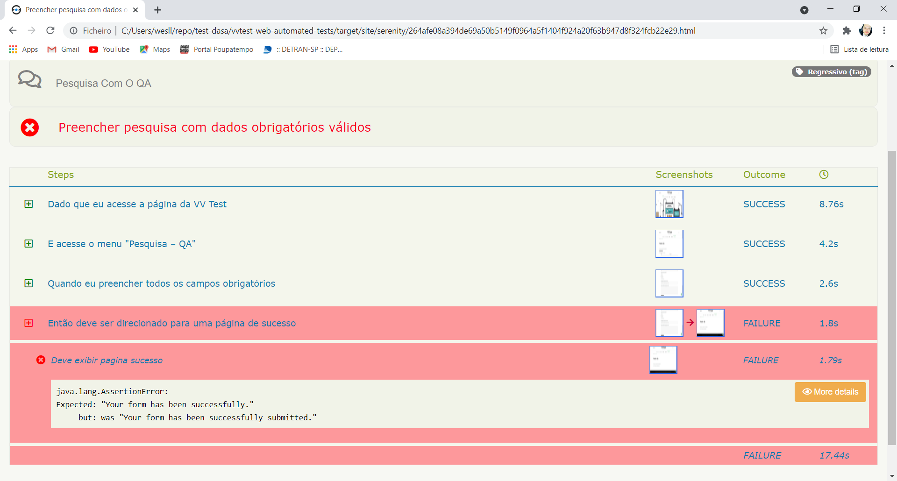

# vvtest-web-automated-tests
Projeto automação web utilizando Serenity BDD (Selenium) + Cucumber

## Descrição do projeto
* serenity.version: 2.4.24
* serenity.junit.version: 2.4.24
* serenity.maven.version: 2.4.24
* serenity.cucumber.version: 2.4.24

## Setup - necessário para execução do projeto:
* Java 8 - Instalação e configuração das variaveis de ambiente.
* Maven - Instalação e configuração das variaveis de ambiente.
* Chrome na versão 91.0

## Run tests:
* mvn verify: Executa todos os testes configurados no arquivo CucumberTestSuite
* mvn verify -Dcucumber.options="--tags @regressivo": Executa todos os testes com a tag @regressivo
* mvn verify -Dheadless.mode=true: Executa os testes em headless
* mvn verify -Dwebdriver.driver=firefox: Seleciona qual driver o teste será executando, podendo ser o chrome, firefox ou ie (o teste foi realizado com base no chrome, podendo gerar falhas em outros browsers, seria necessário mais tempo para explorar a execução em cada browser especifico!). O Chrome já é executado por default.
* mvn verify -Denvironment=hom: Define URL que será setada, caso esse comando não seja especificado, por default é setado a url default. As URL´s podem ser definidas no arquivo serenity.conf.

Exemplo de execução dos testes no chrome sem Headless apontado para um ambiente de homologação: 

mvn clean verify -Denvironment=hom -Dcucumber.options="--tags @regressivo"

## Report:

Após execução do teste (mvn verify) o report será gerado na pasta target/site/serenity/index.html 
ATENÇÃO: O report será gerado somente através do goal VERIFY do Maven.

### Exemplo report com erro:

### Exemplo report com sucesso:

### Detalhamento do report:

### Imagens capturadas no teste

